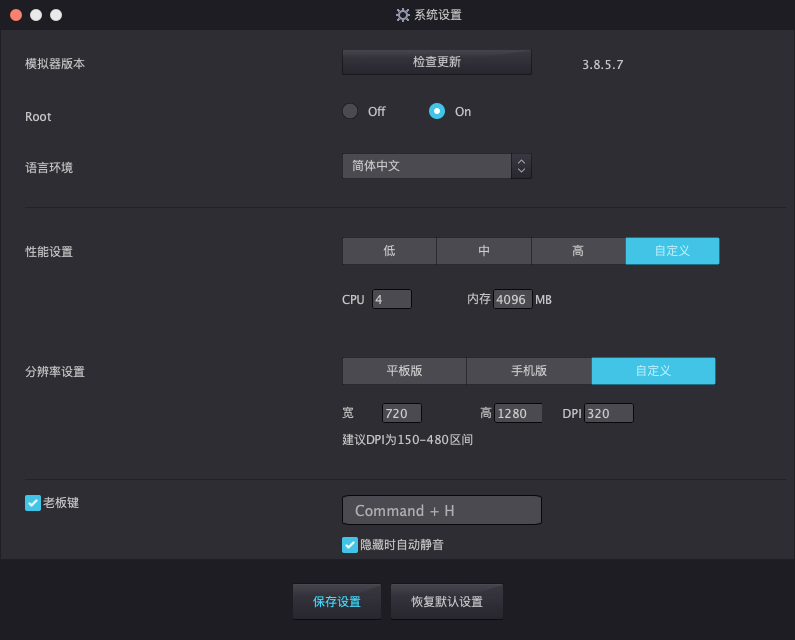

# THSTrader
量化交易工具。同花顺手机版模拟炒股python API，基于uiautomator2方法实现。依赖下面的项目：
* pytdx（用于获取行情）
* uiautomator2（用于读取与操作界面）

## 为什么有这个项目
源于打首板总是破板之后被买进的痛苦，不光是当天蒙受损失，还要等T+1才能卖出，所以就想着能不能写个程序，能够在打首板的时候排队监控买1的手数，如果有人大量撤单，那么程序就能监控到并且撤单，防止破板被迫买进。

## 运行时所需依赖
需要Windows系统哈，别的系统可以考虑自己连接安卓真机改一下截图的参数。
### 1. Python依赖
我使用的是Python3.9，以上版本应该也可以。
``` bash
git clone https://github.com/nladuo/THSTrader.git
cd THSTrader
pip install -r requirements.txt
```

### 2. 安装夜神模拟器（支持Mac、Windows、Linux）
下载链接：[https://www.yeshen.com/](https://www.yeshen.com/)

### 3. 配置模拟器分辨率
模拟器分辨率我用的是720x1280，320dpi，如需其他分辨率请自行修改代码里的参数。


### 4. 安装同花顺APP
在模拟器上安装同花顺APP，模拟器上用浏览器打开链接：[http://focus.10jqka.com.cn/special/phone/wapsubject_8299.shtml](http://focus.10jqka.com.cn/special/phone/wapsubject_8299.shtml) 

安装好之后请登录同花顺APP找到模拟炒股那里保证模拟炒股可以使用，如果不知道怎么操作可以看后面的B站视频。

## 二次开发用到的工具
### 查看[uiautomatorviewer](uiautomatorviewer/README.md)的使用方法
## 运行程序
### 1. 获取可用行情服务器的ip，进入bin/目录下运行：
``` bash
python check.py
参数（可选）:
    --num: 获取可用服务器的数量（默认为5个）
    --out: 输出到文件的路径（默认为当前目录下的ips.toml）
```
### 2. 复制配置文件，然后根据需要修改配置文件：
``` bash
cp .env.toml.example .env.toml
```

### 3. 运行程序，进入项目根目录下运行：
``` bash
python main.py
```